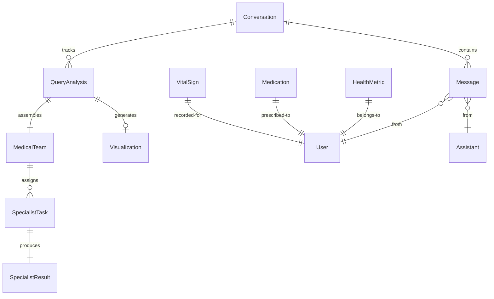

# Data Model Documentation: Multi-Agent Health Insight System

## Overview

This document defines all data entities, their relationships, and validation rules for the Multi-Agent Health Insight System. The models are designed for type safety, extensibility, and clear domain representation.

## Entity Relationship Diagram



## Core System Models

### 1. Conversation

Represents a complete conversation thread with health queries.

```typescript
interface Conversation {
  id: string;                    // UUID
  title: string;                 // Auto-generated from first query
  created_at: string;            // ISO 8601 timestamp
  updated_at: string;            // ISO 8601 timestamp
  messages: Message[];           // Ordered list of messages
  query_analyses: QueryAnalysis[]; // Analysis for each user query
  metadata: {
    total_queries: number;
    total_tokens: number;
    average_complexity: ComplexityLevel;
  };
}

// Validation Rules:
// - id: Valid UUID v4
// - title: 1-200 characters
// - messages: Non-empty array
// - created_at <= updated_at
```

### 2. Message

Individual message in a conversation.

```typescript
interface Message {
  id: string;                    // UUID
  conversation_id: string;       // Foreign key to Conversation
  role: 'user' | 'assistant';   // Message sender
  content: string;               // Message text
  timestamp: string;             // ISO 8601 timestamp
  metadata?: {
    query_index?: number;        // For user messages
    agent?: string;              // Which agent generated (assistant)
    message_type?: MessageType;  // Type classification
    tokens_used?: number;        // Token count
  };
}

enum MessageType {
  QUERY = 'query',
  ANALYSIS = 'analysis',
  SYNTHESIS = 'synthesis',
  VISUALIZATION = 'visualization',
  ERROR = 'error'
}

// Validation Rules:
// - content: 1-10000 characters
// - query_index: Required for user messages
// - agent: Required for assistant messages
```

### 3. QueryAnalysis

Analysis metadata for each health query.

```typescript
interface QueryAnalysis {
  id: string;                    // UUID
  conversation_id: string;       // Foreign key
  query_index: number;          // Which query in conversation
  query_text: string;           // Original query
  complexity: ComplexityLevel;   // Assessed complexity
  medical_team: MedicalTeam;    // Assembled team
  start_time: string;           // ISO 8601
  end_time?: string;            // ISO 8601
  total_execution_time?: number; // Seconds
  status: AnalysisStatus;       // Current status
  error?: string;               // Error message if failed
}

enum ComplexityLevel {
  SIMPLE = 'simple',
  STANDARD = 'standard',
  COMPLEX = 'complex',
  CRITICAL = 'critical'
}

enum AnalysisStatus {
  INITIALIZING = 'initializing',
  ANALYZING = 'analyzing',
  SYNTHESIZING = 'synthesizing',
  VISUALIZING = 'visualizing',
  COMPLETE = 'complete',
  FAILED = 'failed'
}

// Validation Rules:
// - query_index: >= 0
// - complexity: Must be valid enum value
// - end_time: Only set when status is COMPLETE or FAILED
```

## Agent Models

### 4. MedicalTeam

Represents the assembled team for a query.

```typescript
interface MedicalTeam {
  id: string;                    // UUID
  query_analysis_id: string;     // Foreign key
  cmo: AgentInfo;               // Orchestrator
  specialists: SpecialistInfo[]; // Active specialists
  assembly_reason: string;       // Why this team was chosen
  total_specialists: number;     // Team size
}

interface AgentInfo {
  id: string;                    // Agent identifier
  name: string;                  // Display name (e.g., "Dr. Heart")
  role: string;                  // Role description
  avatar?: string;               // Avatar URL/identifier
}

interface SpecialistInfo extends AgentInfo {
  specialty: MedicalSpecialty;   // Medical domain
  status: AgentStatus;          // Current status
  progress: number;             // 0-100 percentage
  start_time?: string;          // When started
  end_time?: string;            // When completed
}

enum MedicalSpecialty {
  CARDIOLOGY = 'cardiology',
  ENDOCRINOLOGY = 'endocrinology',
  LABORATORY_MEDICINE = 'laboratory_medicine',
  DATA_ANALYSIS = 'data_analysis',
  PREVENTIVE_MEDICINE = 'preventive_medicine',
  PHARMACY = 'pharmacy',
  NUTRITION = 'nutrition',
  GENERAL_PRACTICE = 'general_practice'
}

enum AgentStatus {
  WAITING = 'waiting',
  ACTIVE = 'active',
  COMPLETE = 'complete',
  ERROR = 'error'
}

// Validation Rules:
// - specialists: 1-8 specialists
// - progress: 0-100
// - All specialists must have unique specialties
```

### 5. SpecialistTask

Task assigned to a specialist.

```typescript
interface SpecialistTask {
  id: string;                    // UUID
  specialist: MedicalSpecialty;  // Target specialist
  query_analysis_id: string;     // Parent analysis
  task_description: string;      // What to analyze
  priority: TaskPriority;        // Execution priority
  data_required: string[];       // Required data types
  context: {
    patient_query: string;       // Original query
    initial_findings?: any;      // CMO's initial analysis
    other_specialists?: string[]; // Other active specialists
  };
  constraints?: {
    max_tokens?: number;         // Token limit
    timeout_seconds?: number;    // Execution timeout
  };
}

enum TaskPriority {
  HIGH = 'high',
  MEDIUM = 'medium', 
  LOW = 'low'
}

// Validation Rules:
// - task_description: 10-1000 characters
// - data_required: Non-empty array
// - timeout_seconds: 5-300
```

### 6. SpecialistResult

Result from specialist analysis.

```typescript
interface SpecialistResult {
  id: string;                    // UUID
  task_id: string;              // Foreign key to SpecialistTask
  specialist: MedicalSpecialty;  // Which specialist
  status: 'success' | 'partial' | 'failed';
  execution_time: number;        // Seconds
  tokens_used: number;          // Token count
  
  findings: Finding[];          // Key findings
  raw_analysis: string;         // Complete analysis text
  confidence_score: number;     // 0-100
  
  tools_used: ToolUsage[];      // Which tools were called
  error?: {
    code: string;
    message: string;
    recoverable: boolean;
  };
}

interface Finding {
  id: string;                   // UUID
  category: FindingCategory;    // Type of finding
  severity: 'info' | 'warning' | 'critical';
  title: string;               // Brief description
  detail: string;              // Full explanation
  evidence: string[];          // Supporting data points
  recommendations?: string[];   // Action items
}

enum FindingCategory {
  ABNORMAL_VALUE = 'abnormal_value',
  TREND = 'trend',
  RISK_FACTOR = 'risk_factor',
  MEDICATION_ISSUE = 'medication_issue',
  LIFESTYLE = 'lifestyle',
  PREVENTION = 'prevention'
}

interface ToolUsage {
  tool_name: string;
  call_count: number;
  success_count: number;
  total_duration: number;       // Seconds
}

// Validation Rules:
// - confidence_score: 0-100
// - execution_time: > 0
// - findings: May be empty array
```

## Health Domain Models

### 7. HealthMetric

Generic health metric representation.

```typescript
interface HealthMetric {
  id: string;                    // UUID
  user_id: string;              // User identifier
  metric_type: 'lab_result' | 'vital_sign' | 'calculated';
  category: string;             // E.g., "Lipid Panel"
  name: string;                 // E.g., "Total Cholesterol"
  value: number;                // Numeric value
  unit: string;                 // E.g., "mg/dL"
  date_recorded: string;        // ISO 8601
  
  reference_range?: {
    min?: number;
    max?: number;
    optimal?: number;
    description?: string;
  };
  
  status: 'normal' | 'borderline' | 'abnormal' | 'critical';
  source: string;               // Where data came from
  notes?: string;               // Additional context
}

// Validation Rules:
// - value: Must be finite number
// - unit: Non-empty string
// - date_recorded: Valid date not in future
```

### 8. Medication

Medication information.

```typescript
interface Medication {
  id: string;                    // UUID
  user_id: string;              // User identifier
  name: string;                 // Drug name
  generic_name?: string;        // Generic equivalent
  dosage: string;               // E.g., "10mg"
  frequency: string;            // E.g., "Once daily"
  route: string;                // E.g., "Oral"
  
  start_date: string;           // ISO 8601
  end_date?: string;            // ISO 8601, null if current
  status: 'active' | 'discontinued' | 'hold';
  
  prescribed_for: string;       // Condition
  prescriber?: string;          // Doctor name
  
  adherence?: {
    percentage: number;         // 0-100
    missed_doses: number;
    last_taken?: string;        // ISO 8601
  };
  
  side_effects?: string[];      // Reported side effects
  interactions?: string[];      // Known interactions
}

// Validation Rules:
// - dosage: Match pattern /^\d+(\.\d+)?\s*\w+$/
// - adherence.percentage: 0-100
// - start_date <= end_date (if end_date exists)
```

### 9. VitalSign

Vital sign measurements.

```typescript
interface VitalSign {
  id: string;                    // UUID
  user_id: string;              // User identifier
  type: VitalSignType;          // Type of vital
  date_recorded: string;        // ISO 8601
  
  // Type-specific values
  blood_pressure?: {
    systolic: number;
    diastolic: number;
    position?: 'sitting' | 'standing' | 'lying';
  };
  
  heart_rate?: {
    bpm: number;
    rhythm?: 'regular' | 'irregular';
  };
  
  weight?: {
    value: number;
    unit: 'kg' | 'lbs';
    bmi?: number;
  };
  
  temperature?: {
    value: number;
    unit: 'C' | 'F';
    method?: 'oral' | 'ear' | 'forehead';
  };
  
  context?: {
    time_of_day?: string;
    activity_level?: string;
    notes?: string;
  };
}

enum VitalSignType {
  BLOOD_PRESSURE = 'blood_pressure',
  HEART_RATE = 'heart_rate',
  WEIGHT = 'weight',
  TEMPERATURE = 'temperature',
  RESPIRATORY_RATE = 'respiratory_rate',
  OXYGEN_SATURATION = 'oxygen_saturation'
}

// Validation Rules:
// - blood_pressure: systolic > diastolic
// - heart_rate.bpm: 30-250
// - weight.value: > 0
// - temperature: Reasonable human ranges
```

## Visualization Models

### 10. Visualization

Generated visualization metadata.

```typescript
interface Visualization {
  id: string;                    // UUID
  query_analysis_id: string;     // Parent analysis
  type: VisualizationType;       // Chart type
  title: string;                // Chart title
  description: string;          // What it shows
  
  code: string;                 // React component code
  data_summary: {
    source_metrics: string[];    // Which metrics used
    data_points: number;         // Total data points
    time_range?: {
      start: string;
      end: string;
    };
  };
  
  interactivity: {
    features: string[];          // E.g., ["zoom", "pan", "hover"]
    exports: string[];           // E.g., ["png", "csv"]
  };
  
  generation_time: number;       // Seconds to generate
  render_time?: number;         // Seconds to render
}

enum VisualizationType {
  TIME_SERIES = 'time_series',
  COMPARISON = 'comparison',
  DISTRIBUTION = 'distribution',
  CORRELATION = 'correlation',
  DASHBOARD = 'dashboard'
}

// Validation Rules:
// - code: Valid JavaScript/React code
// - data_points: > 0
// - generation_time: > 0
```

## Streaming Event Models

### 11. StreamEvent

Base structure for all SSE events.

```typescript
interface StreamEvent<T = any> {
  id: string;                    // Event ID
  type: EventType;              // Event type
  timestamp: string;            // ISO 8601
  data: T;                      // Event-specific data
}

enum EventType {
  CONNECTED = 'connected',
  MESSAGE = 'message',
  TEAM_ASSEMBLY = 'team_assembly',
  SPECIALIST_PROGRESS = 'specialist_progress',
  SPECIALIST_COMPLETE = 'specialist_complete',
  VISUALIZATION = 'visualization',
  ERROR = 'error',
  DONE = 'done'
}

// Type-specific data interfaces
interface MessageEventData {
  subtype: 'text' | 'thinking' | 'tool_call' | 'tool_result';
  content: string | object;
  agent?: string;
}

interface ProgressEventData {
  specialist_id: string;
  progress: number;
  status: AgentStatus;
  current_task?: string;
}

// Validation Rules:
// - All events must have valid UUID id
// - timestamp must be valid ISO 8601
// - type must be valid enum value
```

## Data Validation Rules Summary

### String Validations
- UUIDs: Valid v4 format
- Timestamps: ISO 8601 format
- Names: 1-200 characters, no special characters
- Descriptions: 1-1000 characters

### Numeric Validations
- Percentages: 0-100
- Counts: >= 0
- Durations: > 0
- Health values: Within human physiological ranges

### Array Validations
- Specialists: 1-8 items
- Findings: 0-50 items
- Messages: 1-1000 items

### Business Logic Validations
- End times must be after start times
- Progress only increases (never decreases)
- Completed agents cannot return to active
- Critical findings require recommendations

This data model provides a comprehensive structure for the multi-agent health insight system while maintaining flexibility for future enhancements and domain adaptations.