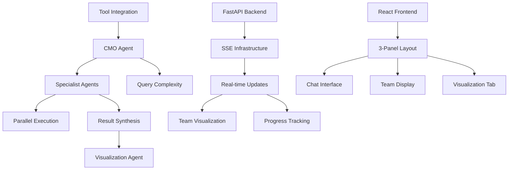

# Feature Prioritization Matrix: Multi-Agent Health Insight System

## Overview

This matrix prioritizes features based on user impact, development effort, and strategic value. Features are categorized as P0 (Must Have), P1 (Should Have), or P2 (Nice to Have) for the MVP demonstration.

## Prioritization Criteria

- **User Impact**: How much value does this provide to users? (High/Medium/Low)
- **Development Effort**: How complex is implementation? (High/Medium/Low)
- **Dependencies**: What must be built first?
- **Demo Value**: How important for showcasing the system?

## Feature Priority Matrix

### P0 - Must Have for MVP (Weeks 1-4)

| Feature | User Impact | Dev Effort | Dependencies | Demo Value | Notes |
|---------|------------|------------|--------------|------------|--------|
| **Core Multi-Agent Orchestration** | High | High | None | Critical | Foundation of entire system |
| CMO agent with query analysis | High | Medium | Tools | Critical | Orchestrator pattern showcase |
| 8 medical specialist agents | High | Medium | CMO agent | Critical | Demonstrates domain depth |
| Query complexity assessment | High | Low | CMO agent | High | Shows intelligent routing |
| Parallel specialist execution | Medium | Medium | Agents | High | Performance optimization |
| Result synthesis by CMO | High | Medium | Specialists | Critical | Unified insights |
| **Real-Time Progress Visualization** | High | Medium | SSE setup | Critical | Key differentiator |
| SSE streaming infrastructure | High | Medium | FastAPI | Critical | Enables all real-time features |
| Medical team hierarchy display | High | Low | Frontend | Critical | Visual wow factor |
| Agent status indicators | High | Low | SSE | Critical | User engagement |
| Progress bars for active agents | Medium | Low | SSE | High | Perceived performance |
| **Health Query Interface** | High | Low | None | Critical | User entry point |
| Natural language input | High | Low | None | Critical | Accessibility |
| Example queries on welcome | High | Low | None | High | Discoverability |
| Query submission flow | High | Low | API | Critical | Core interaction |
| **Data Visualization** | High | High | Viz agent | Critical | Insights delivery |
| Dynamic React component generation | High | High | None | Critical | Technical showcase |
| Time series charts | High | Medium | Recharts | Critical | Most common need |
| Interactive chart features | Medium | Medium | Charts | High | User engagement |
| **Basic Error Handling** | High | Medium | All features | High | Robustness |
| Specialist failure recovery | High | Medium | Agents | High | Graceful degradation |
| Partial result delivery | Medium | Medium | CMO | Medium | Resilience |
| User-friendly error messages | High | Low | Frontend | High | UX quality |

### P1 - Should Have (Weeks 5-6)

| Feature | User Impact | Dev Effort | Dependencies | Demo Value | Notes |
|---------|------------|------------|--------------|------------|--------|
| **Enhanced Visualizations** | Medium | Medium | P0 viz | Medium | Polish |
| Comparison charts | Medium | Medium | Viz agent | Medium | Additional insights |
| Correlation matrices | Medium | High | Data analysis | Low | Advanced use case |
| Multi-panel dashboards | Medium | High | Multiple charts | Medium | Comprehensive view |
| **Query History** | Medium | Medium | Storage | Medium | User convenience |
| Conversation management | Medium | Medium | LocalStorage | Medium | Multi-session support |
| Query selector navigation | Medium | Low | History | Medium | Quick access |
| Auto-generated titles | Low | Low | NLP | Low | Polish |
| **Performance Optimizations** | Medium | Medium | P0 complete | Medium | Scale |
| Response caching | Medium | Medium | Backend | Low | Efficiency |
| Token budget management | Medium | Medium | Agents | Medium | Cost control |
| Lazy loading | Medium | Low | Frontend | Medium | Initial load time |
| **Extended Health Metrics** | Medium | Low | Tools | Medium | Completeness |
| Medication adherence analysis | Medium | Low | Data | High | Valuable insight |
| Risk score calculations | Medium | Medium | Analysis | Medium | Predictive value |
| Lifestyle recommendations | Medium | Low | CMO | Medium | Actionable |

### P2 - Nice to Have (Weeks 7-8)

| Feature | User Impact | Dev Effort | Dependencies | Demo Value | Notes |
|---------|------------|------------|--------------|------------|--------|
| **Advanced UI Features** | Low | Medium | P1 complete | Low | Polish |
| Keyboard shortcuts | Low | Medium | Frontend | Low | Power users |
| Dark mode | Low | Medium | Theming | Low | Preference |
| Print-friendly views | Low | Medium | CSS | Low | Reporting |
| Export functionality | Medium | Medium | Charts | Low | Data portability |
| **AI Enhancements** | Medium | High | P0 complete | Low | Future |
| Predictive health trends | Medium | High | ML models | Low | Advanced feature |
| Personalized insights | Medium | High | User profiles | Low | Customization |
| Cross-user patterns | Low | High | Analytics | Low | Population health |
| **Extensibility Features** | Low | High | Architecture | Low | Platform |
| Plugin system | Low | High | Refactoring | Low | Future growth |
| Custom specialists | Low | High | Framework | Low | Flexibility |
| Domain adaptation toolkit | Low | High | Abstraction | Low | Reusability |
| **Monitoring & Analytics** | Low | Medium | Logging | Low | Operations |
| Usage analytics | Low | Medium | Tracking | Low | Product insights |
| Performance dashboards | Low | Medium | Metrics | Low | Operations |
| A/B testing framework | Low | High | Infrastructure | Low | Optimization |

## Implementation Roadmap

### Week 1-2: Foundation
- [x] Set up FastAPI backend with SSE
- [x] Implement CMO agent with basic orchestration
- [x] Create specialist agent framework
- [x] Build React frontend shell with 3-panel layout
- [x] Establish tool integration

### Week 3-4: Core Features
- [ ] Complete all 8 specialist implementations
- [ ] Implement query complexity assessment
- [ ] Build real-time team visualization
- [ ] Create SSE event streaming
- [ ] Add basic error handling

### Week 5: Visualization & Polish
- [ ] Implement visualization agent
- [ ] Add dynamic chart generation
- [ ] Create time series visualizations
- [ ] Implement progress tracking
- [ ] Add welcome screen with examples

### Week 6: Enhancement
- [ ] Add conversation history
- [ ] Implement query selector
- [ ] Optimize performance
- [ ] Add comparison charts
- [ ] Polish UI/UX

### Week 7-8: Testing & Demo Prep
- [ ] Comprehensive testing
- [ ] Performance optimization
- [ ] Demo script creation
- [ ] Documentation completion
- [ ] Bug fixes and polish

## Success Metrics by Priority

### P0 Success Criteria
- Multi-agent orchestration works for all complexity levels
- Real-time updates visible within 100ms
- Successful query completion rate > 95%
- Visualization generation success > 98%
- Zero critical errors in demo scenarios

### P1 Success Criteria
- Query history persists across sessions
- Performance optimizations reduce response time by 30%
- Extended visualizations cover 80% of use cases
- Token usage optimized by 40%

### P2 Success Criteria
- Keyboard navigation fully functional
- Export features support 3+ formats
- Plugin system documented and tested
- Monitoring captures all key metrics

## Risk Mitigation by Feature

### High Risk Features (Need Contingency)
1. **Dynamic visualization generation**
   - Risk: Code generation failures
   - Mitigation: Pre-built fallback charts
   
2. **Parallel agent execution**
   - Risk: Race conditions
   - Mitigation: Sequential fallback mode

3. **SSE streaming stability**
   - Risk: Connection drops
   - Mitigation: Polling fallback

### Medium Risk Features
1. **Query complexity assessment**
   - Risk: Misclassification
   - Mitigation: Conservative estimates

2. **Token budget management**
   - Risk: Exceeding limits
   - Mitigation: Hard caps per agent

## Feature Dependencies Graph

## Decision Points

### Must Decide by Week 2
- Exact specialist prompt strategies
- SSE event schema finalization
- Visualization component architecture

### Must Decide by Week 4
- P1 feature selection
- Performance optimization approach
- Demo scenario selection

### Can Defer
- P2 feature selection
- Extensibility architecture
- Monitoring implementation

This prioritization ensures we deliver a compelling demonstration of multi-agent orchestration while maintaining development velocity and system quality.